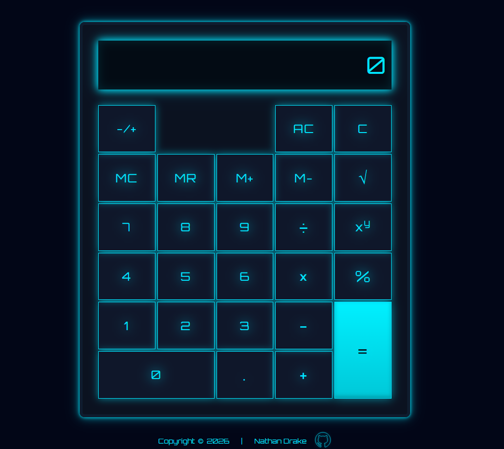

# Calculator

A fully functional on-screen calculator built with **JavaScript, HTML, and CSS** as part of The Odin Project curriculum.

## Features

- Basic operations: addition, subtraction, multiplication, division
- Chained calculations (e.g. `12 + 7 - 1 =`)
- Decimal input support
- Backspace and clear functionality
- Keyboard input support
- Memory functions (MC, MR, M+, M-)
- Sign toggle (+/-)
- Error handling for division by zero
- Responsive display with digit limits

## Tech Used

- JavaScript
- HTML
- CSS

## What I Learned

- Managing application state for multistep user interactions
- Handling edge cases in user input
- Structuring event-driven JavaScript applications
- Building responsive UI layouts with CSS Grid
- Implementing keyboard input alongside UI controls

## Live Demo

[View Live Demo](https://nathan-drake93.github.io/js-calculator)

## Author

Nathan Drake  
GitHub: [Nathan-Drake93](https://github.com/Nathan-Drake93)